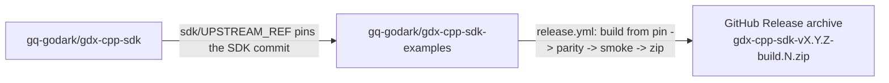

# C++ release-artifact automation — plan

**Repos in scope:** `gq-godark/gdx-cpp-sdk` (the standalone cpp SDK; CMakeLists at the repo root), `gq-godark/gdx-cpp-sdk-examples`
**Goal:** Bring the C++ MM distribution to feature parity with the Python pipeline:

1. A **client-facing** `README.md` + `SDK_REFERENCE.md` that live in this repo separately from any internal docs and only ship inside the released artifact.
2. A **release workflow** (`.github/workflows/release.yml`) that, on every push to `main`, builds the C++ SDK from a **pinned upstream commit**, parity-checks the vendored copy in `sdk/`, smoke-tests it against `examples/`, then **uploads the archive as a workflow artifact and creates a versioned GitHub release**.
3. (Optional, follow-up) An **auto-bump dispatcher/listener** pair that mirrors `notify-examples.yml` + the examples-side `auto-bump-sdk-pin.yml` from the Python chain, so pushes to `gdx-sdk/main` open a rolling PR here.

This plan is the C++ analogue of the Python pipeline in `gdx-python-sdk-examples` (`AUTOMATION_REPORT.md`, `.github/workflows/release.yml`, `scripts/package.sh`, `scripts/refresh_sdk.sh`, `sdk/UPSTREAM_REF`, `bundle/`).

---

## 1. What we already have today

| Concern | Python (`gdx-python-sdk-examples`) | C++ (`gdx-cpp-sdk-examples`) today |
| --- | --- | --- |
| Client-facing README | `bundle/README.md` (separate from repo-root README) | Only repo-root `README.md` |
| Client-facing SDK reference | `bundle/SDK_REFERENCE.md` | Only repo-root `SDK_REFERENCE.md` (no `bundle/` split) |
| Vendored SDK tree | `sdk/godark/` + `sdk/pyproject.toml` | `sdk/include/godark/*` + `sdk/lib/libgodark.a` + `sdk/lib/cmake/...` |
| Upstream pin marker | `sdk/UPSTREAM_REF` (commit SHA) | `sdk/UPSTREAM_REF` (commit SHA, populated by `scripts/refresh_sdk.sh`) |
| Refresh script | `scripts/refresh_sdk.sh` — rsyncs source, records pin, refuses dirty upstream | `scripts/refresh_sdk.sh` — `cmake --install` from a sibling `gdx-cpp-sdk` checkout into a temp build dir, records pin in `sdk/UPSTREAM_REF`, refuses dirty upstream |
| Package script | `scripts/package.sh` — parity-checks vendored copy vs upstream, builds **wheel from upstream**, zips wheels-only bundle | `scripts/package.sh` — copies repo files into a tarball; no parity check, no upstream build |
| Release workflow | `.github/workflows/release.yml` — version-stamped zip, workflow artifact, GitHub Release on push to `main` | **Missing** (no `.github/workflows/` directory yet) |
| Auto-bump on upstream push | `gdx-python-sdk/notify-examples.yml` -> `gdx-python-sdk-examples/auto-bump-sdk-pin.yml` (rolling PR) | **Missing** for cpp |

The shipped artifact also differs in kind:

- **Python ships a wheel** (`wheels/godark-*.whl`). The vendored source under `sdk/godark/` exists for IDEs and reviewers, **never reaches the artifact**, and is parity-checked against upstream `src/godark`.
- **C++ ships a prebuilt static library** (`sdk/lib/libgodark.a` + `sdk/include/godark/*.hpp` + `sdk/lib/cmake/godark/*.cmake`). It is built by the **examples-side refresh script**, with the upstream commit captured in `sdk/UPSTREAM_REF`. The release workflow rebuilds from that pinned commit in a clean runner and parity-checks the result against the vendored copy.

Closing that gap (artifact provenance + automated release) is the main reason to do this work.

---

## 2. Target state



The repo-root `README.md` and `SDK_REFERENCE.md` in this repo continue to be useful when browsing the source tree, but **the files that ship to MMs come from `bundle/`** — same split as Python.

Concretely, on every push to `main`:

1. CI reads `sdk/UPSTREAM_REF` and checks out `gq-godark/gdx-cpp-sdk` at that SHA into `upstream/`.
2. CI runs the upstream `CMakeLists.txt` build inside `upstream/` and `cmake --install`s into a clean prefix.
3. CI **parity-checks** the installed headers / cmake config against the vendored copy in `sdk/`. (The static library is binary so we compare it byte-for-byte against the freshly built one; the headers / `*.cmake` are diffed as text.)
4. CI runs `scripts/package.sh` which stages the bundle:
   - `wheels`-equivalent: `sdk/` (headers + `libgodark.a` + `lib/cmake/godark/*.cmake`) from the **freshly built upstream install**, not from the vendored copy in this repo.
   - `examples/quickstart.cpp`, `examples/full_trader_example.cpp`, `examples/dotenv.hpp`, `examples/CMakeLists.txt`
   - `CMakeLists.txt`, `CMakePresets.json`, `vcpkg.json`
   - `bundle/README.md` -> archive root as `README.md`
   - `bundle/SDK_REFERENCE.md` -> archive root as `SDK_REFERENCE.md`
   - `.env.example`
5. CI does a **recipient smoke test**: unzip into a clean directory, `cmake -B build && cmake --build build` against system-installed (or vcpkg) deps, run `--help` on each binary.
6. On `push to main` only: tag `vX.Y.Z-build.N` and publish a GitHub release with the archive attached.

The contract is the same as Python: **a local edit to `sdk/` can never reach the released artifact** because the artifact is built from the pinned upstream tree.

---

## 3. Required changes (file-by-file)

### 3.1 In `gdx-cpp-sdk-examples`

#### `bundle/README.md` (new)

Trim the current root `README.md` down to MM-facing content:

- Prerequisites (Linux x86_64, CMake >= 3.25, GCC >= 13, apt deps)
- Testnet onboarding (frontend / faucet / API key)
- `.env` workflow
- Build (`cmake -B build && cmake --build build`)
- Run `quickstart` and `full_trader_example`
- Order types limited to `MARKET` / `LIMIT`
- Pointer to `SDK_REFERENCE.md`

Anything that talks about `scripts/refresh_sdk.sh`, the auto-bump flow, or "internal-only" notes stays in the **repo-root** `README.md`, which is not shipped.

#### `bundle/SDK_REFERENCE.md` (new)

Identical to the current root `SDK_REFERENCE.md`. The repo-root copy can either become a symlink (`SDK_REFERENCE.md -> bundle/SDK_REFERENCE.md`) or be deleted; recommend **keeping `bundle/SDK_REFERENCE.md` as the source of truth** so the artifact layout matches Python.

#### `sdk/UPSTREAM_REF` (status: implemented as part of PR 2)

Single line: the 40-char SHA in `gq-godark/gdx-cpp-sdk` whose build produced the binary checked into `sdk/lib/libgodark.a`. Written by `scripts/refresh_sdk.sh`, read by `scripts/package.sh` and `release.yml`. Currently pinned to `298cfd9e74c491c8daf1e40a85294bf69ef38d08`.

#### `scripts/refresh_sdk.sh` (status: implemented as part of PR 2)

Now mirrors the Python `refresh_sdk.sh` 1:1:

- Usage: `./scripts/refresh_sdk.sh /path/to/gdx-cpp-sdk`
- Refuses dirty upstream (tracked diff + untracked files would both make the pin unreproducible).
- Builds into a temp dir (`mktemp -d -t godark-cpp-refresh-XXXXXX`) so the upstream worktree stays clean.
- Records the upstream HEAD SHA (or tag, when HEAD is on one) into `sdk/UPSTREAM_REF`.
- Sanity-checks the install layout: `lib/libgodark.a`, `include/godark/godark.hpp`, and all four `lib/cmake/godark/*.cmake` files must exist after `cmake --install`. If upstream regresses the install rules, refresh fails loudly.

Verified locally: a clean refresh against `gq-godark/gdx-cpp-sdk@298cfd9` produces `sdk/` byte-for-byte identical to the previously committed vendored copy.

#### `scripts/package.sh` (status: implemented as part of PR 3)

Mirrors the Python `package.sh` 1:1 for the C++ shape:

1. Reads `sdk/UPSTREAM_REF`; bails if missing/empty.
2. Resolves upstream source tree:
   - `$UPSTREAM_SRC` env var wins (set by CI).
   - Sibling `../gdx-cpp-sdk` if present.
   - Sibling `../new-sdks/gdx-cpp-sdk` (the local dev layout).
   - Else clones `gq-godark/gdx-cpp-sdk` at the pinned SHA into a temp dir (via `gh` or `git`, `--recurse-submodules`).
3. Verifies `git -C $UPSTREAM_SRC rev-parse HEAD == $PINNED_REF`. Refuses otherwise.
4. Verifies the `gdx-proto` submodule is initialized in upstream.
5. Builds the SDK from `$UPSTREAM_SRC` (Ninja + Release, tests + examples off) and installs into a temp prefix (`mktemp -d -t godark-cpp-pkg-prefix-XXXXXX`).
6. Sanity-checks the install prefix has all expected files (catches upstream regressions to install rules).
7. **Parity check** between the temp install prefix and the vendored `sdk/`:
   - Headers (`include/godark/**/*.hpp`): `diff -r --brief`.
   - CMake package config (`lib/cmake/godark/*.cmake`): `diff -r --brief`.
   - Static library (`lib/libgodark.a`): byte-for-byte `cmp -s`.
   - All three independent — drift in any one fails the build.
8. Stages the bundle layout (see archive layout in the script header).
9. Zips as `<DIST_NAME>.zip` (no `.tar.gz` anymore).
10. Post-flight assertions:
    - No `scripts/`, `bundle/`, `build/`, `.git/`, or `CMakeUserPresets.json` leaked into the archive.
    - No `sdk/UPSTREAM_REF` marker in the archive (internal-only).
    - Every required entry (17 paths) present.

Verified locally (Linux x86_64, against `gq-godark/gdx-cpp-sdk@298cfd9`):

| Scenario | Result |
| --- | --- |
| Happy path (sibling auto-detect) | builds, parity passes, zip produced, 32 entries |
| Happy path (`UPSTREAM_SRC` env, CI shape) | same |
| Recipient smoke (unzip + `cmake --build` + run quickstart) | passes; quickstart prints expected env-missing error |
| Missing `sdk/UPSTREAM_REF` | refuses with explicit error |
| Wrong pin (HEAD != UPSTREAM_REF) | refuses with `git checkout` hint |
| Hand-edit a vendored header | parity check fails; diff'd file shown |
| Byte-tamper `sdk/lib/libgodark.a` | `cmp` fails; size delta shown |

#### `.github/workflows/release.yml` (new)

Direct C++ counterpart of the Python `release.yml`. Skeleton:

```yaml
name: CI / Release

on:
  push:
    branches: [main]
  pull_request:
    branches: [main]

permissions:
  contents: read

concurrency:
  group: ci-${{ github.event_name }}-${{ github.ref }}
  cancel-in-progress: ${{ github.event_name == 'pull_request' }}

jobs:
  build:
    name: Build cpp bundle
    runs-on: ubuntu-22.04           # pin OS to keep libgodark.a reproducible
    timeout-minutes: 30
    outputs:
      version: ${{ steps.ver.outputs.version }}
      bundle_name: ${{ steps.ver.outputs.bundle_name }}
      pinned_ref: ${{ steps.pin.outputs.ref }}
    steps:
      - uses: actions/checkout@v4

      - name: Install system deps
        run: |
          sudo apt-get update -qq
          sudo apt-get install -y -qq \
              ninja-build cmake \
              libboost-dev libboost-system-dev libssl-dev \
              libprotobuf-dev protobuf-compiler nlohmann-json3-dev \
              zip

      - uses: actions/create-github-app-token@v1
        id: app-token
        with:
          app-id: ${{ secrets.GDX_APP_ID }}
          private-key: ${{ secrets.GDX_APP_PRIVATE_KEY }}
          owner: gq-godark
          repositories: gdx-cpp-sdk,gdx-proto

      - name: Read pinned upstream ref
        id: pin
        run: |
          [ -f sdk/UPSTREAM_REF ] || { echo "::error::sdk/UPSTREAM_REF missing"; exit 1; }
          ref="$(tr -d '[:space:]' < sdk/UPSTREAM_REF)"
          [ -n "$ref" ] || { echo "::error::sdk/UPSTREAM_REF is empty"; exit 1; }
          echo "ref=${ref}" >> "$GITHUB_OUTPUT"

      - name: Checkout pinned upstream gdx-cpp-sdk
        uses: actions/checkout@v4
        with:
          repository: gq-godark/gdx-cpp-sdk
          ref: ${{ steps.pin.outputs.ref }}
          path: upstream
          token: ${{ steps.app-token.outputs.token }}
          fetch-depth: 1
          submodules: recursive       # gdx-proto submodule

      - name: Compute version + bundle name
        id: ver
        run: |
          base="$(grep -E 'project\(godark-cpp VERSION' upstream/CMakeLists.txt \
                  | sed -E 's/.*VERSION ([0-9.]+).*/\1/')"
          version="v${base}-build.${{ github.run_number }}"
          bundle_name="gdx-cpp-sdk-${version}"
          echo "version=${version}" >> "$GITHUB_OUTPUT"
          echo "bundle_name=${bundle_name}" >> "$GITHUB_OUTPUT"

      - name: Build bundle via scripts/package.sh
        env:
          UPSTREAM_SRC: ${{ github.workspace }}/upstream
        run: bash scripts/package.sh ${{ steps.ver.outputs.bundle_name }}

      - name: Recipient build smoke (clean dir)
        run: |
          mkdir -p /tmp/recip
          unzip -q ${{ steps.ver.outputs.bundle_name }}.zip -d /tmp/recip
          cd /tmp/recip/${{ steps.ver.outputs.bundle_name }}
          cmake -B build -G Ninja -DCMAKE_BUILD_TYPE=Release
          cmake --build build -j

      - name: Upload bundle as workflow artifact
        uses: actions/upload-artifact@v4
        with:
          name: ${{ steps.ver.outputs.bundle_name }}
          path: ${{ steps.ver.outputs.bundle_name }}.zip
          if-no-files-found: error
          retention-days: 14

  release:
    name: Create GitHub release
    needs: build
    if: github.event_name == 'push' && github.ref == 'refs/heads/main'
    runs-on: ubuntu-latest
    permissions:
      contents: write
    steps:
      - uses: actions/checkout@v4
      - uses: actions/download-artifact@v4
        with:
          name: ${{ needs.build.outputs.bundle_name }}
          path: ./release-asset
      - uses: softprops/action-gh-release@v2
        with:
          tag_name: ${{ needs.build.outputs.version }}
          name: ${{ needs.build.outputs.version }}
          generate_release_notes: true
          fail_on_unmatched_files: true
          files: ./release-asset/${{ needs.build.outputs.bundle_name }}.zip
          body: |
            Automated cpp release built from commit `${{ github.sha }}`.
            libgodark.a built from upstream `gq-godark/gdx-sdk` at pinned ref
            `${{ needs.build.outputs.pinned_ref }}`.
```

Differences vs Python `release.yml` worth flagging:

- `ubuntu-24.04` instead of `ubuntu-latest` — `libgodark.a` pins to a glibc/protobuf; pin the runner so the produced `.a` is stable across reruns and matches the toolchain that produced the vendored `sdk/lib/libgodark.a`.
- `submodules: recursive` on the upstream checkout because `gdx-cpp-sdk` consumes `gdx-proto` via submodule. App-token scope therefore includes both `gdx-cpp-sdk` AND `gdx-proto`.
- Version parsed from upstream's repo-root `CMakeLists.txt` (`project(godark-cpp VERSION X.Y.Z)`), not `pyproject.toml`.
- Smoke test is a `cmake --build` + a `quickstart` launch (expects exit-1 with "Set GODARK_API_KEY_ID..." message — proves the binary linked the shipped `libgodark.a` and reached `main()`), not `pip install + import`.
- Bundle is `.zip` (recommend over `.tar.gz` for cross-platform unzip parity with the Python release).

#### `.gitignore` (small addition)

Add `*.zip` so the locally produced archive isn't accidentally committed (current `.gitignore` already covers `*.tar.gz`). Also ignore `/upstream/` (the CI checkout path).

#### Repo-root `README.md` (small edits)

- Replace the "Packaging for Market Makers" section with a pointer to the workflow + GitHub Releases tab.
- Add a one-paragraph "Internal: refreshing the vendored SDK" section that explains the `refresh_sdk.sh` -> commit `sdk/` + `sdk/UPSTREAM_REF` flow.

### 3.2 In `gdx-cpp-sdk` (standalone upstream)

The **layer-2 dispatcher** that mirrors `gdx-python-sdk/.github/workflows/notify-examples.yml`. Lives in `gq-godark/gdx-cpp-sdk` (the upstream this repo's `sdk/` is built from). Identical body to the Python dispatcher modulo repo names:

```yaml
# .github/workflows/notify-cpp-examples.yml in gq-godark/gdx-cpp-sdk
name: Notify cpp examples of SDK change
on:
  push:
    branches: [main]
  workflow_dispatch:

permissions:
  contents: read

jobs:
  dispatch:
    runs-on: ubuntu-latest
    steps:
      - uses: actions/create-github-app-token@v1
        id: app-token
        with:
          app-id: ${{ secrets.GDX_APP_ID }}
          private-key: ${{ secrets.GDX_APP_PRIVATE_KEY }}
          owner: gq-godark
          repositories: gdx-cpp-sdk-examples
      - name: Trigger gdx-cpp-sdk-examples auto-bump
        env:
          GH_TOKEN: ${{ steps.app-token.outputs.token }}
          SDK_SHA: ${{ github.sha }}
        run: |
          gh api repos/gq-godark/gdx-cpp-sdk-examples/dispatches \
            -f event_type=gdx-cpp-sdk-changed \
            -f "client_payload[sdk_sha]=${SDK_SHA}" \
            -f "client_payload[sdk_branch]=main" \
            -f "client_payload[source_repo]=gdx-cpp-sdk"
```

No `paths:` filter needed (decision §5 row 9 was carried over from when we thought the upstream was the meta-repo `gdx-sdk` with python/rust/js side-by-side — `gdx-cpp-sdk` is a standalone cpp-only repo, so every push is cpp-relevant).

The matching listener (`gdx-cpp-sdk-examples/.github/workflows/auto-bump-sdk-pin.yml`) is the same shape as the python one but runs `scripts/refresh_sdk.sh` instead of the python refresh.

---

## 4. Repo / secret prerequisites

We **reuse the existing `GDX_APP` GitHub App** for all cross-repo auth (no new PATs).
This mirrors the auth strategy chosen for the Python chain.

| Item | Where | Action |
| --- | --- | --- |
| `GDX_APP` installation scope | `gq-godark` org | Extend to include `gdx-cpp-sdk` (for the dispatcher) and `gdx-cpp-sdk-examples` (for the listener + release.yml). |
| `GDX_APP` permissions | `gq-godark` org | Needs `contents: write` and `pull-requests: write` on `gdx-cpp-sdk-examples` for the listener; `contents: read` on `gdx-cpp-sdk` + `gdx-proto` for the release.yml checkout. |
| `GDX_APP_ID` + `GDX_APP_PRIVATE_KEY` secrets | `gdx-cpp-sdk` (for the dispatcher) and `gdx-cpp-sdk-examples` (for the listener + release.yml) | Install in both repos' `Settings -> Secrets and variables -> Actions`. |
| Branch protection on `main` | `gdx-cpp-sdk-examples` | Require the `Build cpp bundle` check to pass before merge, same as Python. |

The `release.yml` upstream checkout step uses `actions/create-github-app-token@v1`
(scoped to `gdx-cpp-sdk` + `gdx-proto`) instead of the PAT pattern used by
`gdx-python-sdk-examples`. The token is consumed by `actions/checkout@v4` on
the upstream repo and inherited by the `submodules: recursive` clone of
`gdx-proto`.

---

## 5. Resolved decisions

| # | Question | Decision |
| --- | --- | --- |
| 1 | Archive format | **`.zip`** (matches python release; cross-platform unzip parity). Today's `.tar.gz` from `scripts/package.sh` is replaced. |
| 2 | Runner OS | **`ubuntu-24.04` only** (revised from `ubuntu-22.04`). The vendored `sdk/lib/libgodark.a` is built by `scripts/refresh_sdk.sh` on an Ubuntu 24.04 dev machine (glibc 2.39, g++ 13.3, libprotobuf 3.21.12 via apt). The CI runner must match that toolchain so the byte-for-byte parity check passes. If the dev environment moves to a different Ubuntu, bump this pin AND re-run `refresh_sdk.sh` on the new image. |
| 3 | `libgodark.a` parity | **Byte-for-byte `cmp`**. Strictest contract; if Boost/protobuf produce non-deterministic archives in practice, revisit (likely fix is `ar -D` deterministic mode, not weakening the check). |
| 4 | Version source | Parse `project(godark-cpp VERSION X.Y.Z)` from upstream's repo-root `CMakeLists.txt`. No new VERSION file. |
| 5 | Cross-repo auth | **Reuse `GDX_APP`** (extend installation scope to `gdx-cpp-sdk` + `gdx-cpp-sdk-examples`). No new PATs. |
| 6 | Distribution kind | **Prebuilt** — ship `libgodark.a` + headers + cmake config. Recipient smoke test in CI links against the shipped `.a`. |
| 7 | Repo-root vs `bundle/` READMEs | **Keep both**. Root copies = internal/browsing convenience. `bundle/` copies = MM-facing, the only ones inside the archive. |
| 8 | Layer-2 auto-bump | **Include in this iteration**. `notify-cpp-examples.yml` (in `gdx-cpp-sdk`) + `auto-bump-sdk-pin.yml` (in this repo) ship together with `release.yml`. |
| 9 | Upstream identity | **`gq-godark/gdx-cpp-sdk` (standalone)**, not the `gdx-sdk` meta-repo `cpp/` sub-tree. The vendored `sdk/` is byte-for-byte reproducible from `gdx-cpp-sdk@298cfd9` (verified locally). Path filters in the dispatcher are unnecessary since `gdx-cpp-sdk` is cpp-only. |

---

## 6. Implementation order

Each step is an independently mergeable PR. Order respects dependencies: docs first (no behavior change), then the local toolchain (`refresh_sdk.sh` + `package.sh`), then CI, then the cross-repo auto-bump.

1. **PR 1 — `bundle/`** [DONE locally, uncommitted]: copy current `README.md` and `SDK_REFERENCE.md` into `bundle/` (MM-facing).
2. **PR 2 — `scripts/refresh_sdk.sh` rewrite** [DONE locally, uncommitted]: refuses dirty upstream, builds into a temp dir, writes `sdk/UPSTREAM_REF`. Verified end-to-end against `~/new-sdks/gdx-cpp-sdk@298cfd9` — zero drift vs the previously committed `sdk/`. `sdk/UPSTREAM_REF` now contains `298cfd9e74c491c8daf1e40a85294bf69ef38d08`.
3. **PR 3 — `scripts/package.sh` rewrite** [DONE locally, uncommitted]: upstream resolution, pin verification, build from upstream into temp prefix, parity check (`cmp` on `libgodark.a`, `diff -r --brief` on headers/cmake), bundle staging with `bundle/README.md` and `bundle/SDK_REFERENCE.md` at archive root, `.zip` output, 17 post-flight assertions. All happy/failure paths verified end-to-end.
4. **PR 4 — provision `GDX_APP`** [BLOCKED on user]: extend installation scope to `gdx-cpp-sdk` + `gdx-cpp-sdk-examples`, install `GDX_APP_ID` / `GDX_APP_PRIVATE_KEY` as repo secrets in both. (No file changes here — purely a GitHub UI task. Done before PR 5 so the workflow can authenticate.)
5. **PR 5 — `.github/workflows/release.yml`** [DONE locally, uncommitted]: build job (`ubuntu-24.04`, apt deps, GDX_APP token scoped to `gdx-cpp-sdk,gdx-proto`, recursive submodule checkout, version from upstream `CMakeLists.txt`, `scripts/package.sh` + recipient smoke build + `quickstart` launch check, `actions/upload-artifact@v4`) and release job (`actions/download-artifact@v4` + `softprops/action-gh-release@v2` with install snippet). Triggers on push + pull_request to `main`. Concurrency cancels stale PR runs but never push-to-main. `actionlint` clean. Will not actually run until PR 4 installs the secrets.
6. **First merge to `main`** — produces `vX.Y.Z-build.1` GitHub Release; verify on the Releases tab and download/test the zip from a clean machine.
7. **PR 6 — layer-2 dispatcher in `gdx-cpp-sdk`**: add `.github/workflows/notify-cpp-examples.yml`. Identical body to `notify-examples.yml` (python) modulo repo names.
8. **PR 7 — layer-2 listener in `gdx-cpp-sdk-examples`**: add `.github/workflows/auto-bump-sdk-pin.yml` triggered by `repository_dispatch: gdx-cpp-sdk-changed`. Checks out upstream at the dispatched SHA, runs `scripts/refresh_sdk.sh`, force-pushes a rolling `auto/bump-sdk` branch + opens/refreshes a PR. Merging the PR triggers `release.yml` -> new tagged zip.

If anything regresses, each PR can be reverted independently; the chain degrades gracefully (e.g. revert PR 7 and humans still run `refresh_sdk.sh` by hand, but `release.yml` keeps producing reproducible zips).

---

## 7. Acceptance criteria

- Repo-root `README.md` and `bundle/README.md` exist and are clearly scoped (internal vs MM-facing).
- `sdk/UPSTREAM_REF` is present and matches the upstream SHA used to produce `sdk/lib/libgodark.a`.
- `bash scripts/package.sh` succeeds on a clean local checkout using `UPSTREAM_SRC=../gdx-sdk` and produces a `.zip` whose `unzip -l` listing matches the layout in §3.1 exactly.
- Pushing a no-op commit to `main` produces a new `vX.Y.Z-build.N` GitHub Release with the archive attached and auto-generated release notes.
- A clean Ubuntu 22.04 container can `unzip`, `cmake -B build && cmake --build build`, and execute `quickstart --help` against the shipped `libgodark.a`.
- A local hand-edit to `sdk/include/godark/*.hpp` causes `release.yml` to fail with "parity check failed" — the artifact contract is enforced.
